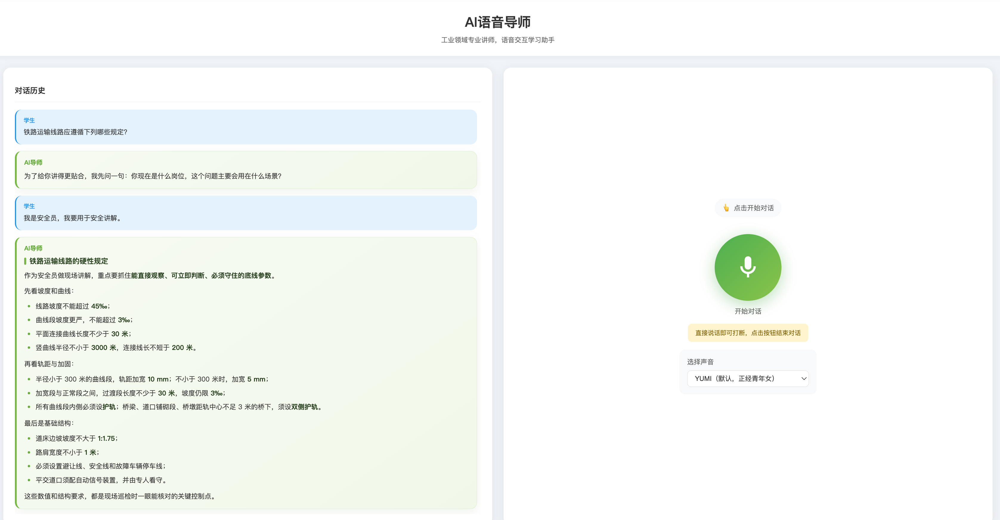

# Voice Tutor

Voice Tutor 是一个面向工业知识讲解场景的 AI 语音讲师项目。本仓库采用前后端单仓库结构，包含实时语音交互前端和基于 FastAPI 的讲师后端。

```text
voice-tutor/
├── backend/     # Voice 后端、讲师 Agent、Wiki/RAG 融合、STT 和 TTS
└── frontend/    # React 语音交互界面
```

## 界面预览



## 主要能力

- 浏览器实时采集麦克风音频
- 实时语音识别与字幕展示
- 识别用户身份、使用场景和上下文追问关系
- Wiki 与 RAG 并行检索及知识融合
- 本地资料不足或来源异常时进行联网降级检索
- 生成适合朗读的口语化讲解内容
- 展示文本与朗读文本分离，自动规范计量单位和特殊符号读法
- Markdown/GFM 回答展示
- 按完整语句分段合成和播放语音
- 播放结束后自动恢复下一轮语音识别
- 多种讲师音色切换

## 技术架构

```text
浏览器麦克风
  -> React 前端
  -> WebSocket /voice/chat
  -> 实时 STT
  -> 讲师 Agent
  -> Wiki + RAG + 联网降级
  -> 回答生成
  -> 分段 TTS
  -> 前端播放并恢复监听
```

## 环境要求

### 后端

- Python 3.9 及以上版本
- 可用的 DashScope/OpenAI 兼容模型服务
- RAG 检索服务（使用 `rag_only` 或 `rag_wiki` 时需要）
- Wiki 服务（使用 `wiki_only` 或 `rag_wiki` 时需要）

### 前端

- Node.js 18 及以上版本，推荐 Node.js 20 LTS
- npm
- 支持 Web Audio API、AudioWorklet 和麦克风权限的现代浏览器

## 安全配置

仓库只提供脱敏模板 `backend/src/conf/config.ini.example`，不包含实际 API Key、Access Key、Secret Key 或密码。首次运行前先复制模板：

```bash
cp backend/src/conf/config.ini.example backend/src/conf/config.ini
```

然后仅在本地 `config.ini` 中替换所有 `<...>` 占位值，并按实际部署修改 `example.com` 示例地址。该文件已被 `.gitignore` 排除。

主要配置区域如下：

- `[paths]`：业务后端、RAG 检索服务地址
- `[minio_config]`：MinIO 地址、Bucket、Access Key 和 Secret Key
- `[llm_config]`：模型名称、OpenAI 兼容接口地址和 API Key
- `[embeddings_config]`：嵌入模型配置
- `[ocr_config]`：OCR 服务地址
- `[voice_config]`：STT、TTS、讲师模型、Wiki 和知识源模式

当前配置模板默认使用 `rag_only`，并可通过 `voice_rag_file_ids` 将检索范围限定到指定文件。

请不要把真实密钥、内网地址、内部模型标识、存储桶名或业务工作空间提交到仓库。可将本地专用配置保存为受 `.gitignore` 保护的文件，并在部署平台使用 Secret 管理功能。

## 启动后端

```bash
cd backend
python3 -m venv .venv
.venv/bin/python -m pip install --upgrade pip
.venv/bin/python -m pip install -r requirements.txt
cp src/conf/config.ini.example src/conf/config.ini
# 编辑 src/conf/config.ini，填写本地服务地址和凭据
.venv/bin/python run_web_api.py
```

后端默认监听：

```text
http://127.0.0.1:18000
```

主要接口：

| 类型 | 地址 | 说明 |
| --- | --- | --- |
| WebSocket | `/voice/chat` | 实时语音讲师会话 |
| HTTP POST | `/app-rag-agent-me/rag-chat` | 通用 RAG 对话接口 |
| HTTP GET | `/docs` | Swagger 文档 |

更完整的后端配置说明见 [backend/README.md](backend/README.md)。

## 启动前端

后端启动后，打开另一个终端：

```bash
cd frontend
npm ci
BROWSER=none npm start
```

前端默认访问地址：

```text
http://localhost:3000
```

当前前端 WebSocket 地址位于 `frontend/src/components/VoiceTutor.jsx`：

```javascript
const WS_URL = 'ws://localhost:18000/voice/chat';
```

部署到其他主机或 HTTPS 环境时，请相应改为目标 `ws://` 或 `wss://` 地址。

更完整的前端说明见 [frontend/README.md](frontend/README.md)。

## 完整本地联调顺序

当后端知识源配置为 `rag_wiki` 时，建议按以下顺序启动：

1. Wiki 后端，默认端口 `8888`。
2. Wiki 前端（仅在需要管理或查看 Wiki 时启动）。
3. RAG 检索服务，默认端口 `18001`。
4. Voice 后端，默认端口 `18000`。
5. Voice 前端，默认端口 `3000`。

## 运行测试

后端测试：

```bash
cd backend
.venv/bin/python -m pip install pytest
.venv/bin/python -m pytest tests -q
```

前端测试：

```bash
cd frontend
npm test -- --watchAll=false
```

## 构建前端

```bash
cd frontend
npm run build
```

构建产物位于 `frontend/build/`。

## 注意事项

- 首次使用时需允许浏览器访问麦克风。
- 非本机部署时，浏览器通常要求通过 HTTPS/WSS 使用麦克风和 WebSocket。
- Wiki、RAG 或模型服务不可用时，请检查后端配置的服务地址和超时时间。
- 有文字但没有语音时，请检查 TTS Key、模型、音色和浏览器音频播放权限。
